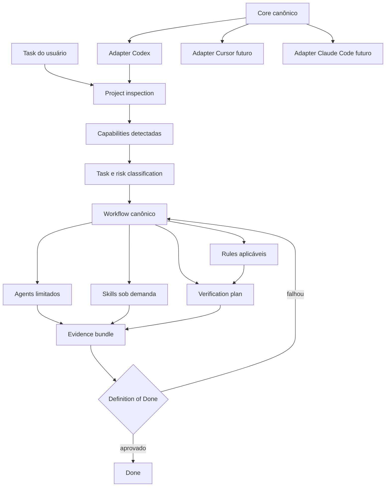

# Arquitetura do Azevedo Engineering

- Status: base arquitetural aprovada; hardening v0.1.1
- Atualização: 2026-09-26
- Pacote previsto: `@azevedo/engineering`
- Configuração local: `azevedo.config.yaml`
- Estado local: `.azevedo/`

## 1. Resumo executivo

O Azevedo Engineering é um engineering harness reutilizável: um sistema operacional de engenharia para coding agents, não uma coleção de prompts. Ele transforma uma solicitação em mudança, evidência e aprendizado governado por meio do fluxo:

```text
Understand → Research → Plan → Implement → Test → Review
           → Verify → Document → Learn → Done
```

O sistema separa quatro preocupações:

- um **core canônico e independente de harness**, com contratos, políticas, workflows, classificação de risco, descoberta de projeto e verification;
- **adapters finos**, que materializam apenas o necessário nas superfícies de Codex, Cursor e Claude Code;
- um **runtime determinístico**, futuramente exposto por CLI/NPM, que inspeciona o projeto, resolve capacidades e gates e registra evidências;
- **artefatos gerados**, que não são fonte de verdade e podem ser regenerados de forma controlada.

O primeiro adapter é o Codex. A fundação não depende de recursos exclusivos dele. O Codex deve receber um `AGENTS.md` curto, papéis especializados somente quando úteis e contexto progressivo. Hooks, plugin, MCP e multi-agent são capacidades opcionais; nunca são a única forma de aplicar uma regra ou cumprir o Definition of Done.

Uma task não termina porque o código foi escrito. `Done` é um gate baseado em critérios de aceite, evidências vinculadas à revisão/diff verificado, testes e revisões proporcionais ao risco, documentação necessária e dispensas explícitas.

## 2. Escopo e princípios

### 2.1 Objetivos

- Transformar o padrão de desenvolvimento Azevedo em contratos reutilizáveis e versionados.
- Suportar projetos novos e existentes sem impor uma arquitetura sobre eles.
- Oferecer comportamento de engenharia consistente em diferentes coding agents, dentro das capacidades reais de cada harness.
- Descobrir stack, topologia, scripts e verificadores antes de selecionar contexto.
- Carregar apenas instruções relevantes ao tipo da tarefa, paths afetados e riscos detectados.
- Produzir evidência legível por pessoas e processável por ferramentas.
- Ser instalável, auditável, reparável e removível sem sobrescrever trabalho do usuário.
- Aprender com sessões sem promover automaticamente observações a políticas distribuídas.

### 2.2 Não objetivos da v0.1.1

- Implementar o CLI completo ou publicar o pacote NPM.
- Construir um plugin Codex completo.
- Implementar hooks, MCP, auto-update ou runtime completo de continuous learning.
- Criar um catálogo amplo de agents, skills e rules.
- Criar um scaffold completo de aplicação ou `create-azevedo-app`.
- Copiar ou instalar o ECC, buscar paridade de catálogo ou depender dele em runtime.
- Fixar modelos específicos de um coding agent.

### 2.3 Harness e arquitetura de referência são produtos distintos

O **Engineering Harness** descobre e respeita a arquitetura real do projeto. A **Azevedo Reference Architecture** é uma composição recomendada para novos projetos quando aplicável:

- TypeScript, NestJS, Next.js e Zod;
- PostgreSQL com Drizzle;
- MongoDB com Mongoose quando o caso de uso justificar eventos/logs;
- Tailwind e Zustand quando necessários;
- pnpm workspaces e Turborepo como referência para monorepos;
- React Native/Expo futuramente.

Esses defaults não são requisitos do core. Um projeto existente com Prisma, npm e um único pacote é válido e não deve ser migrado implicitamente para Drizzle, pnpm ou monorepo. Um gerador de aplicações poderá existir futuramente, mas será outro produto.

## 3. Pesquisa do ECC

### 3.1 Recorte analisado

O repositório `affaan-m/ecc` foi tratado como upstream de conhecimento. A análise cobriu organização canônica, integração Codex, manifests, perfis, agents, skills, rules, workflows, hooks, verification, TDD, code/security review, context management e continuous learning.

Fontes primárias:

- [ECC README](https://github.com/affaan-m/ECC/blob/main/README.md)
- [ECC AGENTS.md](https://github.com/affaan-m/ECC/blob/main/AGENTS.md)
- [ECC Codex supplement](https://github.com/affaan-m/ECC/blob/main/.codex/AGENTS.md)
- [Codex Navigation Guide](https://github.com/affaan-m/ECC/blob/main/docs/CODEX-NAVIGATION-GUIDE.md)
- [Cross-harness architecture](https://github.com/affaan-m/ECC/blob/main/docs/architecture/cross-harness.md)
- [Harness adapter compliance](https://github.com/affaan-m/ECC/blob/main/docs/architecture/harness-adapter-compliance.md)
- [Install profiles](https://github.com/affaan-m/ECC/blob/main/manifests/install-profiles.json)
- [Install modules](https://github.com/affaan-m/ECC/blob/main/manifests/install-modules.json)
- [Verification loop](https://github.com/affaan-m/ECC/blob/main/skills/verification-loop/SKILL.md)
- [TDD workflow](https://github.com/affaan-m/ECC/blob/main/skills/tdd-workflow/SKILL.md)
- [Code reviewer](https://github.com/affaan-m/ECC/blob/main/agents/code-reviewer.md)
- [Security review](https://github.com/affaan-m/ECC/blob/main/skills/security-review/SKILL.md)
- [Hooks](https://github.com/affaan-m/ECC/blob/main/hooks/README.md)
- [Continuous learning v2](https://github.com/affaan-m/ECC/blob/main/skills/continuous-learning-v2/SKILL.md)
- [Strategic compact](https://github.com/affaan-m/ECC/blob/main/skills/strategic-compact/SKILL.md)
- [Iterative retrieval](https://github.com/affaan-m/ECC/blob/main/skills/iterative-retrieval/SKILL.md)

As decisões para Codex também foram confrontadas com a documentação oficial atual:

- [OpenAI: AGENTS.md](https://developers.openai.com/codex/agent-configuration/agents-md)
- [OpenAI: subagents](https://developers.openai.com/codex/agent-configuration/subagents)
- [OpenAI: build skills](https://developers.openai.com/plugins/build/skills)
- [OpenAI: rethinking skills and prompts](https://developers.openai.com/blog/rethinking-skills-and-prompts-for-gpt-6-astra)

### 3.2 Síntese crítica

O ECC demonstra separação cross-harness, instalação seletiva, workflows reutilizáveis e boas práticas de review e evidence. Sua escala também expõe riscos: catálogos e superfícies podem divergir, políticas universais podem misturar preferências e invariantes, e conteúdo específico de múltiplos domínios aumenta contexto sem ajudar a tarefa atual.

O Azevedo Engineering adota os princípios úteis, mas começa pequeno. Não haverá cópia integral, dependência de runtime, paridade de catálogo ou sincronização automática com o ECC. Atualizações do upstream serão analisadas e classificadas antes de qualquer adoção.

### 3.3 Matriz de decisão

| Conceito | Como o ECC resolve | Relevância | Decisão | Aplicação no Azevedo Engineering |
|---|---|---|---|---|
| Core compartilhado + adapters | Mantém conteúdo comum e superfícies específicas por harness | Evita três produtos independentes | **TRAZER** | Core canônico; adapters traduzem descoberta, configuração e papéis |
| Skills como workflows focados | `skills/` concentra procedimentos carregáveis sob demanda | Favorece progressive disclosure | **ADAPTAR** | Skills pequenas; workflow coordena referências sem copiar instruções |
| `AGENTS.md` + configuração Codex | Orientação geral e detalhes específicos | Permite baseline sempre presente | **ADAPTAR** | `AGENTS.md` curto; detalhes e papéis ficam no adapter |
| Papéis especializados read-only | Explorer/reviewer usam escopo e sandbox limitados | Reduz risco e separa revisão de autoria | **TRAZER** | Explorer, architect, reviewer e security-reviewer |
| Catálogo amplo de agents | Papéis por linguagem, domínio e framework | Pode especializar grandes instalações | **DESCARTAR** inicialmente | Novo agent exige responsabilidade não sobreposta e benefício medido |
| Rules comuns e específicas | Camadas por linguagem/stack | Separa invariantes de exemplos | **ADAPTAR** | Seletores por capacidade, path e risco; arquitetura existente prevalece |
| Verification loop | Executa build, types, lint, testes, segurança e diff | Impede conclusão baseada só em código | **ADAPTAR** | Verificadores determinísticos descobertos e evidence records por revisão |
| RED/GREEN | Exige falha antes da implementação e registra o ciclo | Prova regressão em bugs e regras novas | **ADAPTAR** | Obrigatório quando tecnicamente razoável; sem commits artificiais |
| Review por severidade/confiança | Findings incluem localização e cenário de falha | Reduz feedback vago | **TRAZER** | Finding schema e gate por severidade |
| Security review por gatilhos | Ativa em auth, inputs, endpoints, DB, secrets e deps | Segurança proporcional à mudança | **ADAPTAR** | Gatilhos de risco; conteúdo alinhado à stack detectada |
| Hooks event-driven | Checks antes/depois de ferramentas | Acelera feedback | **REFERÊNCIA** | Fora do MVP; nunca requisito de correctness ou DoD |
| Context compaction/retrieval | Compacta em fronteiras e refina buscas | Controla uso de contexto | **ADAPTAR** | Checkpoints e exploração incremental por lacunas |
| Continuous learning | Observações ganham escopo, confiança e evidência | Separa sinal de regra | **ADAPTAR** | Quarentena e promoção exclusivamente humana |
| Profiles/manifests | Compõem módulos por instalação | Permite seleção auditável | **ADAPTAR** | Perfis somente de stack/capability; rigor vem do risco da task |
| Doctor/repair/uninstall | Rastreia propriedade e preserva arquivos | Necessário para distribuição responsável | **TRAZER** futuramente | Estado local, hashes, dry-run e operações reversíveis |
| MCPs e configuração global | Oferece integrações prontas e sync para home | Amplia capacidades | **DESCARTAR** inicialmente | Opt-in futuro; nenhuma mudança global silenciosa |
| Modelo fixo por papel | Papéis escolhem modelo/esforço | Controla operação numa versão | **DESCARTAR** | Adapter herda defaults do usuário |

## 4. Arquitetura proposta

### 4.1 Visão em camadas



### 4.2 Planos do sistema

#### Descoberta

Inspeciona o projeto de forma read-only e conservadora. Produz topologia, package manager, linguagens, frameworks, persistência, validação, styling, estado, testes, scripts, capabilities, unknowns, ambiguidades e conflitos, sempre acompanhados de evidência determinística.

#### Conhecimento

Contém regras, skills, perfis de stack, referências e decisões arquiteturais. É declarativo, versionado e independente do harness.

#### Controle

Classifica task e risco, seleciona workflow, resolve componentes e gates e controla transições. Não existe profile de rigor configurável: a intensidade deriva da combinação de stack detectada, tipo de tarefa, paths afetados e sinais de risco.

#### Execução

Executa verificadores determinísticos. Não interpreta política; recebe um plano resolvido e devolve evidence records.

#### Integração

Adapters convertem contratos canônicos para arquivos e capacidades nativas. Eles conhecem Codex, Cursor ou Claude Code, mas não redefinem os padrões de engenharia.

#### Evidência e aprendizado

Evidence records aprovam gates. Findings descrevem riscos observados. Waivers tornam exceções explícitas. Aprendizado permanece em quarentena até decisão humana.

### 4.3 Metamodelo canônico

Componentes têm metadados validados por schema e relações por identificador, nunca por texto copiado:

```yaml
id: review.code
version: 1
kind: agent | skill | rule | workflow | verifier | stack-profile
summary: "Descrição curta"
applies_when: []
tags: []
requires: []
conflicts_with: []
stability: experimental | beta | stable
owners: []
```

Os contratos públicos iniciais também cobrem inspection, capability, task classification, risk, workflow, evidence, finding, waiver, TDD decision e subject revision.

## 5. Responsabilidades e fronteiras

### 5.1 Agents

Um agent é um **papel de análise**, com missão, autoridade e contrato de saída limitados. O agente principal continua dono da task e da integração dos resultados.

Conjunto inicial:

- `explorer`: localiza fatos, dependências, convenções e riscos no repositório; read-only;
- `architect`: avalia mudanças com impacto arquitetural real; read-only;
- `reviewer`: revisa correctness, regressão, testes e aderência ao plano; read-only;
- `security-reviewer`: revisa trust boundaries, abuso e vulnerabilidades; read-only.

O architect só é acionado quando há nova dependência estrutural, boundary, estratégia de persistência ou autenticação, novo package/app/integração, mudança de contrato público, fluxo entre componentes ou decisão tecnológica significativa.

Agents não contêm regras completas de stack, workflows inteiros nem comandos de verificação. Papéis Codex são estreitos e herdam o modelo configurado pelo usuário.

### 5.2 Skills

Uma skill é um **procedimento reutilizável carregado sob demanda para um objetivo reconhecível**. Ela declara triggers e non-triggers, inputs, etapas, output, critérios de sucesso, limites de autoridade e referências progressivas.

A arquitetura suporta inicialmente `plan-change`, `tdd-change`, `code-review`, `security-review` e `verification-dod`. A v0.1.1 implementa seus contratos e pontos de extensão, não precisa materializar todo o conteúdo.

Skills não definem política global nem orquestram todo o ciclo. A descrição deve ser curta e precisa; referências detalhadas são carregadas somente quando necessárias.

### 5.3 Rules

Uma rule é uma **invariante declarativa**, selecionada por capability, path, tipo de tarefa ou risco e idealmente verificável. Cada rule declara selector, severidade, racional, exceções e verifiers relacionados.

Rules dizem o que deve permanecer verdadeiro. Elas não duplicam o procedimento de uma skill ou a orquestração de um workflow. Regras de Drizzle, por exemplo, só se aplicam quando Drizzle foi detectado ou configurado explicitamente.

### 5.4 Workflows

Um workflow é uma **máquina de estados que coordena fases, referências, gates e artefatos**. Ele referencia agents, skills, rules e verifiers por ID.

O workflow padrão preserva todas as fases, mas a intensidade é proporcional. Para uma correção documental, Research e Plan podem ser breves e Test pode ser `not_applicable`. Para auth ou migration, pesquisa, plano, security review e verificação recebem maior profundidade.

### 5.5 Verification

Verification transforma afirmações em **evidência reproduzível**. Um verifier declara aplicação, target, scope, executor, diretório, inputs, resultado esperado, timeout, severidade, evidence schema e remediação. Em monorepos, cada target é resolvido a partir dos `affectedPaths` e de scopes estruturados adicionais quando uma raiz/shared afeta consumidores conhecidos; o mesmo `verifierId` pode produzir gates independentes para múltiplos packages sem acoplar o core aos seus nomes.

Coverage é sinal auxiliar. Não há threshold universal. Os gates priorizam comportamento alterado, risco de regressão, regras de negócio e caminhos críticos.

### 5.6 Adapters

Um adapter traduz o modelo canônico para um harness. Ele mapeia caminhos, papéis, permissions, capabilities e artefatos, reporta degradações e valida a saída. Não mantém uma versão autoral de rules/skills, não promete paridade inexistente e não muda configuração global sem consentimento explícito.

### 5.7 Hooks

Hooks são aceleradores futuros. Podem formatar, alertar ou executar checks rápidos, mas estão fora da v0.1.1 e jamais sustentam sozinhos correctness, segurança ou Definition of Done.

### 5.8 Project inspection e perfis de stack

Inspection sempre precede `init`. A detecção usa apenas evidência determinística, como lockfiles, manifests, workspaces, dependências e scripts. Quando os sinais conflitam ou não são suficientes, o resultado é `ambiguous` ou `unknown`, nunca uma suposição silenciosa.

Perfis descrevem stack/capability, não rigor. Os perfis iniciais previstos são:

- `typescript`;
- `nestjs`;
- `nextjs`;
- `postgres-drizzle`;
- `mongodb-mongoose`;
- futuramente `react-native-expo`.

O manifest Azevedo compõe esses perfis como arquitetura de referência. Um projeto só ativa os componentes compatíveis com sua inspeção ou overrides explícitos.

### 5.9 Classificação de tarefa e risco

O resolver combina tipo da tarefa, paths afetados e sinais concretos. As classes conceituais iniciais são:

- `trivial`: baixo impacto e verificação localizada, como docs sem comportamento;
- `normal`: mudança de produto comum, reversível e coberta por verificações existentes;
- `high-risk`: auth, contrato público, persistência/migration, integração, boundary ou blast radius relevante;
- `critical`: credenciais, dados sensíveis, mudança destrutiva/irreversível, autorização crítica ou operação de produção de alto impacto.

Os nomes podem evoluir antes de estabilizar a API, mas não haverá um seletor manual equivalente a `light/standard/strict`. Todo passo obrigatório precisa reduzir um risco concreto e produzir evidência útil.

Classificação estruturada fornecida pelo coding agent tem precedência. Heurísticas PT/EN complementam paths e discovery como sinais, sem se tornar um dicionário autoritativo. Uma alteração rotineira de dependência é `normal` por padrão; somente `structural_dependency` ou outro sinal arquitetural promove risco e aciona o architect.

### 5.10 Política de TDD

TDD é decidido pelo tipo da mudança:

- bug reproduzível: RED/GREEN obrigatório quando tecnicamente razoável;
- nova regra de negócio ou comportamento: normalmente TDD;
- refactor: provar comportamento com testes existentes e preencher gaps relevantes, sem RED artificial;
- UI/CSS: usar verificação apropriada, sem teste falhando artificial;
- configuração/infra: verificação do domínio;
- documentação: TDD `not_applicable`.

O relatório registra `applied`, `not_applicable` ou `waived`, sempre com motivo. Waiver é excepcional e explícito. O harness não exige commits intermediários para RED/GREEN.

Quando TDD está `applied`, RED e GREEN referenciam evidence records reais da mesma task, do mesmo verifier e scope. RED deve ser uma execução `tdd-red` que falhou numa revisão anterior; GREEN deve ser uma execução `tdd-green` que passou na revisão final e ocorreu depois de RED.

## 6. Como evitar duplicação

- Policy vive em `rules`.
- Procedimento vive em `skills`.
- Orquestração vive em `workflows`.
- Execução determinística e evidence contracts vivem em `verification`/runtime.
- Papel e autoridade de especialista vivem em `agents`.
- Tradução de produto vive em `adapters/<harness>`.

Workflows e agents usam IDs, não inclusão textual. Arquivos como `.codex/agents/*.toml`, `.agents/skills/*` ou blocos de `AGENTS.md` são artefatos gerados e rastreáveis. Índices e capability matrices devem ser derivados dos metadados. Contract tests detectam IDs inexistentes, referências quebradas e drift entre fonte e adapter.

## 7. Workflow e Definition of Done

### 7.1 Contrato das fases

| Fase | Resultado mínimo | Gate de saída |
|---|---|---|
| Understand | objetivo, escopo, restrições e aceite | ambiguidades críticas resolvidas ou registradas |
| Research | evidência suficiente do projeto e docs primárias | lacunas relevantes conhecidas |
| Plan | change map, risco, testes e rollback quando aplicável | plano proporcional e verificável |
| Implement | mudança mínima ligada ao aceite | sem expansão silenciosa |
| Test | provas comportamentais ou justificativa de N/A | testes aplicáveis passam; RED/GREEN quando exigido |
| Review | findings com evidência e disposição | nenhum bloqueante aberto |
| Verify | gates resolvidos e executados | required targets passam ou têm waiver válido para o mesmo scope |
| Document | docs/ADR/changelog necessários | operação e comportamento não divergem |
| Learn | zero ou mais candidates com proveniência | nenhuma promoção automática |
| Done | relatório final e evidence bundle | DoD satisfeito para a revisão atual |

### 7.2 Evidência local

Detalhes de execução ficam em `.azevedo/evidence/`, ignorados pelo Git. O relatório final resume o que foi executado, o que não foi executado, skips, waivers, findings, revisão e revisão/diff verificado. Evidência não deve ser commitada por padrão.

Estados de evidence:

```text
pass | fail | skipped | waived | not_applicable
```

`skipped` não equivale a sucesso. `waived` exige waiver válido para a mesma task, target e scope. `not_applicable` exige justificativa e não satisfaz um target já classificado como obrigatório; a aplicabilidade deve ser resolvida antes de o target entrar no gate de `Done`. Evidence records incluem task, verifier, phase, scope, comando, tempos, exit code, subject revision/diff digest, output digest, sumário e motivo.

### 7.3 Definition of Done

Uma task só alcança `Done` quando:

- critérios de aceite estão ligados a implementação e evidência;
- não há mudança fora de escopo sem explicação;
- targets obrigatórios estão `pass` ou `waived` de forma válida para a mesma task e scope;
- skips, waivers e itens não aplicáveis são explícitos;
- reviews obrigatórias não têm finding bloqueante aberto;
- riscos de segurança e migrations foram tratados quando aplicáveis;
- documentação necessária foi atualizada;
- evidence refere-se à revisão/diff atual;
- o relatório distingue execução real de inferência.

## 8. Review, ADR e aprendizado

### 8.1 Code review

Cada finding registra severidade, confiança, localização, cenário concreto, impacto observável, evidência e status. Zero findings é válido. Preferências estilísticas só são findings quando violam regra explícita ou escondem risco real.

### 8.2 Security review

É acionada por auth/autorização, contratos externos, inputs/uploads/URLs/webhooks, queries e migrations, secrets/PII/logs, dependências/permissões, processos/filesystem, serialização e integrações. O conteúdo específico é selecionado pela stack detectada.

### 8.3 ADRs

Decisões significativas ficam em `docs/decisions/` com contexto, problema, decisão, alternativas, consequências e status. ADR não é changelog de toda implementação; aplica-se a boundaries, dependências estruturais, persistência, autenticação, contratos públicos, estratégia e decisões tecnológicas relevantes.

### 8.4 Continuous learning governado

```text
observation → candidate → accepted/rejected → promoted artifact
```

Candidates registram proveniência, evidência, contraexemplos, confiança, escopo e destino proposto. Ficam locais e ignorados por padrão. Nenhuma observation, candidate, instinct ou finding vira automaticamente rule, skill, policy, verifier ou conteúdo distribuído. Toda promoção exige aprovação humana; promoção cross-project exige aprovação explícita.

## 9. Context discovery no Codex

### 9.1 Baseline mínimo

O Codex recebe sempre apenas identidade do projeto, limites de autoridade, comandos descobertos, DoD resumido e roteamento de contexto. Isso cabe em um `AGENTS.md` curto. Manuais, catálogos e skills completas não devem ser inseridos no baseline sempre carregado.

### 9.2 Descoberta progressiva

1. Inspection lê arquivos estruturais e manifests.
2. O router classifica task, paths, capabilities e risco.
3. O adapter expõe somente componentes aplicáveis.
4. O Codex carrega uma skill quando seu trigger corresponde ou ela é chamada explicitamente.
5. A skill abre referências apenas no passo que precisa delas.
6. Exploração começa por símbolos, imports, testes e paths próximos e expande por lacunas explícitas.
7. Tarefas longas persistem checkpoint com objetivo, decisões, arquivos, testes, riscos e próximo passo.

Em monorepos, `AGENTS.md` aninhados só existem quando um subtree possui comandos ou regras realmente diferentes. Eles acrescentam contexto local em vez de repetir a raiz.

### 9.3 Adapter Codex v0.1.1

O adapter inicial materializa contratos para `AGENTS.md` e quatro arquivos `.codex/agents/*.toml`. Os papéis usam sandbox read-only e não fixam modelo. A configuração é project-local. Plugin, hooks, MCP e mudanças globais ficam fora do MVP.

## 10. Estrutura de diretórios

A v0.1.1 mantém um único package para reduzir cerimônia. A separação interna já permite extrair packages quando distribuição e compatibilidade exigirem:

```text
azevedo-engineering/
├── docs/
│   ├── ARCHITECTURE.md
│   └── decisions/                 # ADRs significativos
├── src/
│   ├── core/
│   │   ├── schemas/               # metamodelo e contratos públicos
│   │   ├── discovery/             # inspection read-only
│   │   ├── profiles/              # stack profiles/reference manifest
│   │   ├── risk/                  # task/risk classification
│   │   ├── agents/                # papéis canônicos
│   │   ├── workflows/             # workflow padrão
│   │   └── verification/          # planning, executors e DoD
│   ├── adapters/
│   │   └── codex/                 # materialização Codex mínima
│   └── index.ts
├── tests/
│   ├── contracts/
│   ├── discovery/
│   ├── risk/
│   ├── verification/
│   ├── adapters/
│   └── fixtures/
│       ├── monorepo/              # arquitetura de referência mínima
│       └── single-repo/           # projeto existente não-Azevedo
├── azevedo.config.yaml
├── package.json
└── tsconfig.json
```

No futuro, `schemas`, `runtime` e `cli` podem virar packages independentes sem alterar os contratos. Um diretório de plugin só deverá existir quando houver implementação real do plugin.

## 11. Distribuição futura por CLI/NPM

O pacote será `@azevedo/engineering`, com execução por `npx @azevedo/engineering`. Não haverá mutação por `postinstall`.

Fluxo futuro:

```text
npx @azevedo/engineering inspect
npx @azevedo/engineering init
npx @azevedo/engineering plan --target codex
npx @azevedo/engineering apply --target codex
npx @azevedo/engineering diff
npx @azevedo/engineering verify
npx @azevedo/engineering doctor
```

`inspect` é read-only e precede `init`. Seu relatório contém tecnologias, topologia, package manager, scripts, stack profiles, capabilities, verifiers recomendados, unknowns, conflitos e ambiguidades. `init` materializa apenas componentes compatíveis com a descoberta e overrides confirmados.

`.azevedo/state.json` futuramente registrará versão, resolução, arquivos/blocos gerenciados, hashes e overrides. Arquivos modificados pelo usuário serão preservados e reportados. Configuração global será sempre opt-in.

Um plugin Codex poderá ser destino futuro do adapter, mas CLI + arquivos project-local são a estratégia inicial. Cursor e Claude Code deverão usar o mesmo core.

## 12. Estratégia de testes

### 12.1 Testes determinísticos

- schemas e referências do metamodelo;
- discovery conservadora e precedência da arquitetura existente;
- classificação de task/risco e resolução de gates;
- evidence, waivers e cálculo de DoD;
- materialização e limites do adapter Codex;
- verifiers sem shell implícito e resolução por affected scope;
- vínculo de evidence à revisão/diff.

### 12.2 Fixtures

A fixture monorepo representa, sem impor, a referência `apps/api`, `apps/web`, `packages/database`, `packages/contracts` e `packages/shared`, com pnpm/Turborepo. A fixture single-repo representa um projeto existente com escolhas diferentes, incluindo Prisma, para provar que inspection não força Drizzle nem monorepo.

### 12.3 Evals futuros

Skills terão casos positivos, negativos, indiretos, incompletos e adversariais. Activation e output quality serão avaliados separadamente. Evals probabilísticos não substituem contract tests e verificações reais.

## 13. Decisões arquiteturais adotadas

1. Core harness-agnostic é a fonte de verdade; adapters são finos.
2. Project inspection é read-only, conservadora e anterior a `init`.
3. A arquitetura existente prevalece; a stack Azevedo é referência, não requisito.
4. Monorepo é referência e fixture, não pressuposto do core.
5. Perfis são de stack/capability; rigor deriva dinamicamente do risco.
6. TDD é aplicado por tipo de mudança, sem RED ou commits artificiais.
7. Coverage não possui threshold universal.
8. Verification e evidence vinculadas à task, target, scope e revisão são primeira classe.
9. Evidência detalhada é local e ignorada; o relatório final contém o resumo auditável.
10. Done é um gate, não uma declaração narrativa.
11. Quatro agents read-only formam o conjunto inicial; architect só atua em impacto real.
12. ADRs registram apenas decisões significativas.
13. Continuous learning exige promoção humana em todos os casos.
14. Distribuição começa por CLI/NPM e arquivos project-local; plugin é futuro compatível.
15. Hooks, MCP e configuração global não pertencem ao MVP.
16. ECC é upstream de conhecimento, não dependência nem fonte copiada.

ADRs relacionados:

- [ADR-0001 — Core canônico e adapters finos](decisions/0001-core-canonico-e-adapters-finos.md)
- [ADR-0002 — Descoberta conservadora e precedência do projeto](decisions/0002-descoberta-e-precedencia-do-projeto.md)
- [ADR-0003 — Entrega baseada em risco, evidência e governança](decisions/0003-entrega-baseada-em-risco-e-evidencia.md)

## 14. Limite da fundação v0.1.1

A v0.1.1 mantém o escopo da fundação e adiciona somente hardening de contratos:

- schemas do metamodelo;
- manifest/perfis iniciais da stack Azevedo;
- contratos de evidence, finding, waiver e TDD decision;
- project inspection inicial e capabilities detectadas;
- classificação de task e risco;
- quatro papéis canônicos e adapter Codex mínimo;
- workflow padrão;
- um ou dois verifiers determinísticos e avaliação de DoD;
- contract tests;
- fixture monorepo mínima e fixture single-repo mínima.
- targets de verification por affected paths;
- validação semântica das evidências RED/GREEN;
- waivers vinculados a task, target e scope;
- heurísticas PT/EN e distinção entre dependency change rotineira e estrutural.

O trabalho deve parar após essa fundação estar verificada. CLI completo, plugin, hooks, MCP, catálogo de conteúdo, scaffold de projeto, runtime completo de aprendizado, auto-update, publicação NPM e integração em projetos reais pertencem a incrementos posteriores sujeitos a aprovação.
