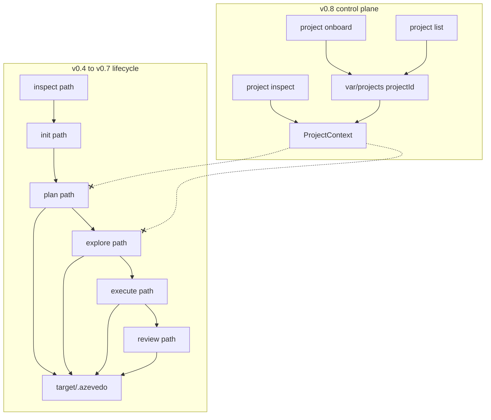
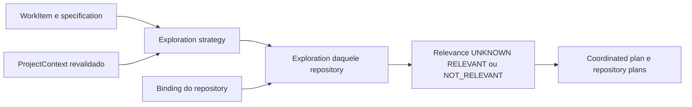

# Proposta v0.9 — Control plane externo do lifecycle

- Status: **proposta revisada, ainda não autorizada para implementação**. Não é ADR aceito. Não é instrução operacional.
- Data: 2026-10-01
- Revisão: decisões de lifecycle, relevance, recorte v0.9.0, dogfood, knowledge hook e CLI incorporadas abaixo. A ordem antiga (plan conservador antes da exploration) está **superseded** nesta proposta.
- Origem: dogfood do Síndico Pro (onboarding v0.8 + pedido de Spec → Explore → Plan sem `init` no target)
- Engine auditado: Azevedo Engineering `0.8.0`

Este documento não implementa nada. Não altera o Síndico Pro. Não promove facts do dogfood a `ProjectKnowledge`. A arquitetura geral foi aceita para evoluir; o milestone continua parado para revisão humana.

A premissa rejeitada: **não** basta mover `target/.azevedo/` para `var/projects/`. Essa cópia colide identidades, mistura path local com contrato portátil e trata um project-group como se fosse um único `project.root: "."`.

---

## Como ler

| Seção | Conteúdo |
| --- | --- |
| A | Mapa do runtime atual, CLI → core → disco |
| B | Descompasso que a v0.8 tornou visível |
| C | Inventário de artifacts, e o que não pode ser reinterpretado |
| D | Lifecycle e modelo de identidade |
| E | Persistência no workspace |
| F | CLI |
| G | Semântica multi-repositório e repository relevance |
| H | ProjectContext orienta; Exploration decide |
| I | Destino do `init` legado |
| J | Compatibilidade v0.4–v0.8 |
| K | Trust boundaries |
| L | Gancho futuro de knowledge |
| M | Dogfood v0.9.0 — Síndico Pro, até o Plan |
| N | Fronteira do milestone |
| O | Consequências problemáticas |
| P | Ordem de implementação, ainda não autorizada |

Contratos vigentes continuam em `src/` e nos ADRs 0001–0015. Este texto descreve o estado atual com fidelidade e uma arquitetura de destino; não autoriza mutation.

---

## A. Current-state runtime map

Há dois pipelines. Eles não se encontram.



Identidade usada pelo lifecycle de engenharia: **`realpath` de um diretório**. Identidade usada pelo onboarding: **`projectId`**. Nenhum comando `plan` / `explore` / `execute` / `review` recebe `projectId`.

`validateInitializedProject` é **gate do CLI**, não das funções canônicas. `buildEngineeringPlan`, `exploreProject`, `prepareExecution` e `prepareReview` não o chamam. O CLI de `plan`, `explore` e `execute` sim. O CLI de `review` não.

### A.1 inspect (path)

| Pergunta | Resposta |
| --- | --- |
| Identidade | Path absoluto do diretório inspecionado. Sem id hashed. `kind: project \| project-group`. |
| CLI | Path. Default `"."` relativo a `process.cwd()`. |
| Um repo? | Não exige git. Topology `single-repo` / `monorepo` / `unknown`. Grupo só se a raiz for `unknown`. |
| Lê | Manifests, lockfiles, scripts. Não lê `.azevedo`, config, AGENTS, registry. |
| Grava | Nada. |
| `.azevedo` / config / AGENTS | Não. |
| `cwd` / `"."` | Sim. Default path `"."`. |
| ProjectContext | Não. |
| Project-group | Sim, filhos imediatos. `relativePath` = nome da pasta. |
| Multi-repo | Só irmãos no mesmo container. Sem `repositoryId` estável. |

Funções: `src/cli/command.ts`, `src/core/inspection/inspect-result.ts`, `src/core/discovery/inspect-project.ts`.

### A.2 project onboard / list / inspect

| Pergunta | Resposta |
| --- | --- |
| Identidade | `projectId` (create-once). Snapshot `snapshot-<16 hex>` via `canonicalJson`. |
| CLI | Path no onboard; `projectId` no inspect. Workspace = `--workspace` / `AZEVEDO_WORKSPACE` / cwd. |
| Um repo? | Não. `layout: single-repository \| project-group`. |
| Lê | Target (read-only) + `var/projects/` + binding. |
| Grava | Só o workspace: `project.json`, snapshots, `current.json`, binding. |
| `.azevedo` / config / AGENTS | Não cria no target. |
| ProjectContext | **Sim**, só aqui. |
| Multi-repo | Sim, via `repositoryId` + binding relativo. |

Funções: `src/cli/project-command.ts`, `src/core/project/*`.

### A.3 init

| Pergunta | Resposta |
| --- | --- |
| Identidade | Sem artifact id. Relatório usa path absoluto. Config gravada: `project.root: .`. |
| CLI | Path. |
| Um repo? | Grupo aplica o mesmo conjunto **em cada filho**. Nada na raiz agregadora. |
| Lê | Inspection + bytes atuais dos destinos. |
| Grava | `azevedo.config.yaml`, `AGENTS.md`, `.azevedo/README.md`, `.codex/agents/*.toml`. |
| Depende de init prévio | Não; init **produz** o que plan/explore exigem. |
| ProjectContext | Não. |
| Multi-repo | Instalações independentes. Sem contrato coordenado. |

Gate futuro: ADR-0005. Ownership: config e `.azevedo/README.md` são Azevedo-managed; `AGENTS.md` e papéis Codex são adapter-managed.

### A.4 plan

| Pergunta | Resposta |
| --- | --- |
| Identidade | `plan-<slug>-<8 hex>` = SHA-256 de `JSON.stringify({ description, topology, targetScopes })`. Topology ∈ `single-repo \| monorepo`. Single-repo força `targetScopes: ["."]`. |
| CLI | Path + `--task`. Sem `--dry-run`. Sem `projectId`. |
| Um repo? | Recusa `kind: project-group`. Aceita monorepo como **um** tree. |
| Lê | Inspection + trio init. |
| Grava | `<root>/.azevedo/plans/<plan-id>.json` (create-only). |
| `.azevedo` / config / AGENTS | **Sim os três.** Config precisa ser exatamente o schema v1 com `root: .` e `adapter: codex`. |
| `project.root` | Literal `"."`. |
| ProjectContext | Não. |
| Group | CLI bloqueia. `buildCoordinatedEngineeringPlan` existe e **não** é chamado. |

`buildEngineeringPlan` cita `azevedo.config.yaml` como evidence **sem reler o arquivo**.

### A.5 specification

Não há `azevedo spec`.

| Pergunta | Resposta |
| --- | --- |
| Identidade | `spec-<slug>-<8 hex>` = hash do conteúdo (title, objective, ACs, provenance, …). |
| Entrada | `explore --spec <file>` resolvido contra **cwd do CLI**, não contra o target; ou `createTaskSpecification(plan)` se omitido. |
| Invariante | `specification.objective === plan.task.description` (match exato). |
| Grava | Só no explore persistido: `.azevedo/specifications/<id>.json`. |
| ProjectContext | Não. |
| Group | Uma spec pode ser compartilhada na API coordenada; o CLI não produz spec de grupo. |

### A.6 explore

| Pergunta | Resposta |
| --- | --- |
| Identidade | `exploration-<12 hex>` inclui `planId`, `specificationId`, `sourceRevision`, evidence ids, modo, surfaces, `stopReason`. Git dirty muda o id. |
| CLI | Path + `--plan`. Recusa group. |
| Lê | Trio init + `.azevedo/plans/<id>.json` + source tree (budget 240) + git/`SubjectRevision`. |
| Grava | spec + exploration + revision, ou `--dry-run` (ainda exige plan **já** no target). |
| ProjectContext | Não. `resolveContextManifest` é chamado **sem** `contextSources: ["project-context"]`. |
| Multi-repo | Não no CLI. A API de grupo chama `exploreProject` por filho, in-memory, sem persistir. |

### A.7 plan revision

Sem comando próprio. Sempre gerada pelo explore, `sequence: 1`, sem encadear revisões existentes.

Path: `.azevedo/plans/<plan-id>/revisions/<revision-id>.json`.

`basis.sourceArtifactIds` aponta para paths `.azevedo/specifications/…` e `.azevedo/explorations/…`.

O plan base **não** é reescrito (ADR-0007).

### A.8 readiness + guided execution

| Pergunta | Resposta |
| --- | --- |
| Identidade | Preparation `preparation-<12 hex>`. Session `execution-<n>-<10 hex>`. Snapshot `execution-snapshot-<n>-<10 hex>`. Sequence = scan de diretórios **naquele** `.azevedo/executions/`. |
| CLI | Path + `--revision --prepare`. Recusa group. Exige init. |
| Um repo? | Sim, um checkout. |
| Lê | Revision + spec + exploration citadas no `basis`. Checkpoint git no root. |
| Grava | `.azevedo/executions/preparations/<id>.json`; context+session só se `mutationAuthorized`. |
| Mutation | `readiness ready` ≠ autorização. Autorização exige `--authorize-isolated-write` **e** `gitMode === "linked-worktree"`. |
| Attempt / Change | Schemas aninhados na session. CLI **nunca** preenche. Sem `CodingAgent` implementado. |
| Verification runtime | Library only. CLI não executa scripts. |
| ProjectContext | Não. |
| Group | `prepareProjectGroupExecution` in-memory, `writeAuthorized: false`, sem session. |

### A.9 verification

Sem CLI. `runVerificationTarget` spawna no `resolve(projectRoot, packagePath)` com `shell: false`. Command-effect autoritativo after-the-fact. Target id = `` `${verifierId}::${scope}` ``. Isolation default: linked worktree + `sameWorkspace`.

### A.10 review / security review

| Pergunta | Resposta |
| --- | --- |
| Identidade | Context `review-context-<12 hex>`. Preparation `review-preparation-<12 hex>`. Report `review-report-<n>-<12 hex>`. |
| CLI | Path + `--execution --base --prepare`, ou `--submission <file>` (file contra **cwd**). Recusa group. **Não** chama `validateInitializedProject`. |
| Lê | Latest session em `.azevedo/executions/<id>/`. Git diff no root. |
| Grava | `.azevedo/reviews/<contextId>/…` |
| Providers | Interfaces. CLI não produz findings sozinho. |
| ProjectContext | Não. Review recusa `sourceReference: "project-knowledge"` nos testes. |
| Group | Sem review agregado. |

### A.11 Suposições “project == cwd / um repositório”

Lista fechada do que o código assume hoje:

1. CLI de engenharia resolve um único `root` via path/`cwd`.
2. `EngineeringPlan.project.root` e `ExplorationArtifact.project.root` são `z.literal(".")`.
3. `InitializedProject.projectRoot` e `azevedo.config.yaml` exigem `root: .`.
4. Single-repo ⇒ `targetScopes: ["."]`.
5. Persistência de plan/spec/explore/revision/execution/review é `join(projectRoot, ".azevedo/…")`.
6. `readPlan` / loaders de execution e review só conhecem esse layout.
7. `captureSubjectRevision` e `captureProjectCheckpoint` usam git com `cwd: projectRoot` (HEAD pode ser do toplevel se o path for subdir).
8. `workspaceIdentity` é digest de **pathname absoluto**, não de conteúdo.
9. Sequence de execution/review é ordinal **por checkout**.
10. Project-group do inspect usa **nome de pasta**, não `repositoryId`.
11. Coordinated plan persiste `projectPath` group-relative, não `repositoryId`.
12. `--spec` e `--submission` resolvem contra cwd do operador.
13. Harness dirty ignore lista `.azevedo`, `.codex`, `AGENTS.md`, `azevedo.config.yaml` **dentro do target**.
14. Dois checkouts git independentes no registry nunca entram no mesmo plan/explore/execute/review.
15. Plan ID **não** inclui `projectId` nem `repositoryId`. Dois single-repos com a mesma task geram o **mesmo** `plan-id` e conteúdos diferentes (Nest vs Next). Hoje isso é inofensivo porque cada um grava no próprio `.azevedo`. No control plane, é conflito create-only.

---

## B. Architectural mismatch introduced/exposed by v0.8

A v0.8 cumpriu o que prometeu: o Azevedo **conhece** um projeto externo sem instalá-lo. ADR-0015 e `docs/ARCHITECTURE.md` §18 declaram, sem ambiguidade, que **não** há integração do `ProjectContext` em `explore`/`plan`.

O dogfood do Síndico Pro tornou isso operacionalmente bloqueante:

- O produto vive em **dois** git repos. Onboarding descreve o grupo. Plan/explore exigem escolher um filho **e** `init` nesse filho.
- Persistência de intenção ainda mora no target. Isso contradiz “os target repositories devem conter apenas o produto”.
- `init` é a única ponte entre os dois mundos, e é exatamente a ponte que a v0.8 recusou como onboarding.

Não é um bug de CLI. São dois modelos de identidade:

| | Lifecycle v0.4–v0.7 | Registry v0.8 |
| --- | --- | --- |
| Chave | filesystem root | `projectId` |
| Repo | um tree (ou monorepo) | N `repositoryId`s |
| Path | `"."` dentro do artifact | binding local, fora do digest |
| Estado | `.azevedo/` no produto | `var/` no workspace |
| Grupo | recusado no CLI de plan/explore | layout nativo |
| Conhecimento | ContextManifest do catálogo ECC-derived | ProjectFact / ProjectKnowledge |
| Mutation | gated por worktree no mesmo root | `authorizesMutation: false` |

Mover `.azevedo` para `var/projects/<id>/` **reproduz o modelo da esquerda** no disco da direita. Os sintomas:

- colisão de `plan-id` entre server e web;
- `project.root: "."` sem dizer *de qual* repository;
- sequences e checkpoints amarrados a um checkout;
- group plan indexado por pasta, que deixa de ser identidade se o binding mudar;
- harness files (`AGENTS.md`, config) ainda precisariam existir *em algum lugar* se o gate de init permanecer.

A v0.9 precisa **endereçar o lifecycle pelo registry**, não relocar a pasta.

Há um segundo descompasso interno, anterior à v0.8: **dois algoritmos de grupo**.

- `createInspectResult`: grupo só se a raiz for topology `unknown`; filho entra por `package.json`.
- `discoverRepositories`: grupo se a raiz não tem git **nem** manifesto (lista mais larga: `go.mod`, Prisma, compose, …); git na raiz força `repositoryId: "root"` e nested git vira unknown.

No Síndico Pro os dois coincidem (container sem git e sem manifesto; dois filhos com `package.json` e git). Não é invariante. A v0.9 deve usar o mapa do registry (`ProjectDefinition.repositories`) como autoridade de “quais repos existem”, e inspection pontual de cada binding como evidência de stack — não o scan rasa do container a cada `plan`.

---

## C. Artifact inventory

### C.1 Persistidos no target hoje (`.azevedo/`)

| Artifact | Identidade | Path atual | Refs a root/path | Refs a outros artifacts | Mutável? | Escopo | Se for ao control plane sem redesenho |
| --- | --- | --- | --- | --- | --- | --- | --- |
| EngineeringPlan | `plan-<slug>-<8 hex>` (task+topology+scopes) | `.azevedo/plans/<id>.json` | `project.root: "."`, `targetScopes: ["."]` | evidence de inspection/config | create-only | um checkout | colide entre repos do grupo; perde `repositoryId` |
| FeatureSpecification | `spec-<slug>-<8 hex>` (conteúdo) | `.azevedo/specifications/<id>.json` | provenance portátil; default aponta `.azevedo/plans/…` | plan (por objective) | create-only | intenção (já é feature-scoped) | path de provenance quebra; conteúdo é o melhor candidato a WorkItem |
| ExplorationArtifact | `exploration-<12 hex>` (inclui git revision) | `.azevedo/explorations/<id>.json` | `project.root: "."`, evidence paths relativos ao tree | planId, specificationId | create-only | um checkout | evidence sem `repositoryId`; id muda com dirty |
| EngineeringPlanRevision | `plan-revision-<n>-<8 hex>` | `.azevedo/plans/<planId>/revisions/<id>.json` | snapshot com `root: "."`; `subjectRevision` daquele tree | spec, exploration, KUs | create-only | um checkout | `sourceArtifactIds` com prefixo `.azevedo/` |
| ExecutionPreparation | `preparation-<12 hex>` | `.azevedo/executions/preparations/<id>.json` | implícito pelo root do loader | revision, context/session ids | create-only | um checkout | sequence/loader amarrados à pasta |
| ExecutionContext | `execution-context-<12 hex>` | `.azevedo/executions/<session>/context.json` | `allowedPaths` relativos ao tree; source refs `.azevedo/…` | plan, revision, spec, exploration | create-only | um checkout | permissions sem `repositoryId` |
| ExecutionSession | `execution-<n>-<10 hex>` | `.azevedo/executions/<id>/sessions/<snapshot>.json` | checkpoint + workspaceIdentity (hash de path absoluto) | context, revision, evidence | snapshot create-only | um checkout | identity de workspace não é portátil; ordinal local |
| ReviewContext | `review-context-<12 hex>` | `.azevedo/reviews/<id>/context.json` | change-set paths relativos | spec/plan/revision/exploration/execution; sourceReference **inconsistente** (às vezes sem `.azevedo/plans`) | create-only | um checkout | não agrega dois diffs |
| ReviewPreparation | `review-preparation-<12 hex>` | `.azevedo/reviews/<ctx>/preparations/<id>.json` | — | context | create-only | um checkout | idem |
| ReviewReport | `review-report-<n>-<12 hex>` | `.azevedo/reviews/<ctx>/reports/<id>.json` | — | context, findings | create-only | um checkout | ordinal local; sem report de grupo |
| Init artifacts | sem id | `azevedo.config.yaml`, `AGENTS.md`, `.azevedo/README.md`, `.codex/agents/*.toml` | `root: .` | adapter Codex | create/unchanged/conflict | um checkout | **não devem ir ao control plane como requisito de lifecycle** |

### C.2 Aninhados (não têm arquivo próprio)

| Artifact | Onde vive | Notas |
| --- | --- | --- |
| ExecutionReadiness | preparation / retorno de `assessExecutionReadiness` | Não persistido sozinho no CLI além de ir dentro da preparation. |
| ExecutionAttempt | `session.attempts[]` | CLI nunca escreve. `maxAttempts: 3`. |
| ExecutionChange | `session.changes[]` | Path relativo ao tree da session. |
| ProjectCheckpoint | `session.before` / `after` | `workspaceIdentity` local. `gitMode` decide isolation. |
| SubjectRevision | exploration, checkpoint, evidence | head + worktreeDigest + dirty daquele root. |
| EvidenceRecord | `session.verificationEvidence[]` | id 16 hex, sem prefixo estável. |
| ExplorationEvidence | dentro da exploration | path relativo **sem** `repositoryId`. |
| ReviewChangeSet / ReviewEvidence / TrustBoundary / RiskCoverageGap / FindingCandidate / ConsolidatedFinding / ReviewUnknown | review context/report | `ReviewChange.path` é relativo a um único git. |
| CorrectionPolicy | opcional no report | append-only; não executa correção. |

### C.3 Persistidos no workspace hoje (`var/`)

| Artifact | Identidade | Path | Mutável? | Escopo |
| --- | --- | --- | --- | --- |
| ProjectDefinition | `projectId` | `var/projects/<id>/project.json` | create-only | projeto |
| Registry pointer | — | `var/projects/<id>/current.json` | replace atômico | projeto |
| ProjectSnapshot | `snapshot-<16 hex>` | `var/projects/<id>/snapshots/<id>.json` | create-only | projeto |
| ProjectBinding | `projectId` | `var/local/bindings/<id>.json` | create-only; rebind fora de v0.8 | máquina |
| ProjectObservation / Fact / Unknown / Knowledge | ids `observation-` / `fact-` / `unknown-` / knowledge digest | dentro do snapshot | via snapshot novo | repo ou projeto |
| ProjectContext | digest canônico; `live` fora | stdout de `project inspect` | derivado | projeto |

### C.4 Existem no core e **não** são persistidos

- `CoordinatedEngineeringPlan` (`project-group-plan-<12 hex>`, scopes `project-scope-<10 hex>`)
- `CoordinatedExecutionPreparation` (`project-group-preparation-<12 hex>`)
- `ContextManifest` (vai *dentro* de exploration/execution/review, não é arquivo)
- `VerificationRuntimeResult`
- `ReviewSubmission` (arquivo do operador, cwd)

`CoordinatedEngineeringPlan` e `CoordinatedExecutionPreparation` continuam só em memória. A leitura anterior desta proposta — tratar o coordinated plan como o germe do WorkItem — está retirada. Esse plano nasce **antes** da exploration, marca todo scope `required: true` e indexa `projectPath`. WorkItem é outro artifact. O coordinated plan do control plane também é outro artifact, posterior à exploration. Copiar `.azevedo` continua errado; reutilizar esse schema como se já fosse o lifecycle novo também.

### C.5 Hashing

- Registry v0.8: `canonicalJson` + `sha256Digest` (chaves ordenadas, portátil).
- Plan / spec / exploration / revision / execution ids: `JSON.stringify` (ordem de inserção importa).

A v0.9 **não** deve recalcular ids antigos com `canonicalJson`. Artifacts novos do control plane devem nascer no algoritmo do registry. Dois algoritmos convivem; silent reinterpretation é proibida.

---

## D. Lifecycle e modelo de identidade

A ordem histórica do lifecycle legado existe porque `exploreProject` exige um `EngineeringPlan` já persistido: `specification.objective` tem de ser igual a `plan.task.description`, o id da exploration inclui `planId`, e a revision faz snapshot desse plano (ADR-0007). `buildEngineeringPlan` produz esse container a partir de inspection + task, com `affectedPaths` vazios. `createTaskSpecification(plan)` ainda aponta a provenance para `.azevedo/plans/<id>.json`.

Essa ordem **não** entra no control plane.

```text
Project
  → WorkItem
  → Specification
  → Exploration          (ProjectContext só como estratégia)
  → Repository Relevance
  → Coordinated Engineering Plan
  → repository Engineering Plans
```

`EngineeringPlan` volta a significar um plano de implementação sustentado por evidência. Não é o artifact quase vazio que destrava a exploration.

Guided Execution, Verification e Review continuam desenhados para a v0.9.1 no mesmo endereço (`projectId`, `workItemId`, `repositoryId`). A v0.9.0 para no plano persistido.

### D.1 O que permanece, o que é novo

| Peça | No control plane v0.9.0 | Por quê |
| --- | --- | --- |
| `Project` / `Repository` / `Binding` | Reuso direto (ADR-0015) | Já são a identidade. Path só no binding. Sem `project bind`. |
| Conteúdo de especificação (title, objective, ACs, open questions, scenarios) | Reuso das regras, **não** do artifact legado | A autoridade continua humana (ADR-0009). O schema `feature-specification` exige provenance `engineering-plan` ou fonte humana com reference portátil, e `createTaskSpecification` só existe a partir de um plano. |
| Motor de reconnaissance | Reuso interno, **não** a assinatura `exploreProject(plan, spec)` | A função recusa rodar sem um `EngineeringPlan` parseado. Fabricar um plano descartável para satisfazer a assinatura recria o container vazio. |
| `PlanStep`, risk, verification **como vocabulário** | Reuso possível dentro do plano novo | São classificações, não identidade. |
| `EngineeringPlan` legado (`project.root: "."`, `createPlanId(task, topology, scopes)`) | Só no CLI por path | No store compartilhado o mesmo id colide entre server e web, e `root: "."` não diz qual repository. |
| `ExplorationArtifact` (`kind: exploration-artifact`, `planId` obrigatório, `project.root: "."`) | Só no CLI por path | Gravar `workItemId` dentro de `planId` seria reinterpretar o campo. |
| `CoordinatedEngineeringPlan` (`projectPath`, `required: boolean`, planos embutidos, sempre `required: true`) | Não persistir. Não mapear relevance nele | `required: false` não significa “ainda não sabemos”. O builder atual roda **antes** da exploration. |
| `EngineeringPlanRevision` | Não é passo da v0.9.0 | A revision existe para enriquecer um plano que já foi congelado cedo. Aqui o primeiro plano já nasce depois da evidência. Emitir `sequence: 1` vazia restaura o container. |
| Execution / review / verification runtime | Desenho apenas | v0.9.1. Nenhum campo “para depois” no plano da v0.9.0. |

Artifacts novos, com `kind` próprio. Não são `schemaVersion: 2` de um arquivo legado.

- **WorkItem** — intenção nomeada sobre um Project. Handle estável. Não é projeto, não é monorepo, não é specification, não é plano.
- **WorkItem specification** — specification daquele WorkItem. Conteúdo supplied. Provenance cita o WorkItem e, se houver, a fonte humana. Não cita `.azevedo/plans/`.
- **Repository exploration** — evidência do código atual de um `repositoryId`, mais a relevance daquele repository, mais a orientação usada (ids de facts consultados). Não carrega `planId`.
- **Coordinated engineering plan** — índice posterior à relevance. Não embute um plano legado. Não usa `projectPath`.
- **Repository engineering plan** — plano de implementação de um repository `RELEVANT`. `affectedPaths` só com evidência da exploration. Paths de outro repository não entram.

```text
Project (projectId)
  └── Repository (repositoryId) ── Binding.path (local, fora do digest)
  └── WorkItem (workItemId)
        ├── repository set congelado na criação
        ├── WorkItem specification
        ├── Repository exploration × N
        │     ├── orientation (facts como estratégia, não como veredito)
        │     └── relevance: UNKNOWN | RELEVANT | NOT_RELEVANT
        └── Coordinated engineering plan
              └── Repository engineering plan  (somente RELEVANT)
```

v0.9.1, sem artifact na v0.9.0: execution, verification e review penduram no mesmo trio `projectId` + `workItemId` + `repositoryId`. Review agregado continua `untrusted-context` para ProjectContext. Isso evita o beco; não cria store agora.

### D.2 Identidades

Digest dos artifacts novos: `canonicalJson` do registry (chaves ordenadas). O algoritmo `JSON.stringify` de plan/spec/exploration legados não é recalculado.

```text
workItemId = work-<slug(objective)>-<canonicalDigest({ projectId, objective })[:12]>
```

Mesma frase no mesmo projeto reencontra o mesmo id. Frase diferente é outro WorkItem. Topology, nome de pasta, remote e commit não entram.

O conjunto de repositories **não** entra no id. Na criação, o default é a lista de `repositoryId` do `ProjectDefinition` naquele momento, copiada para o WorkItem. Um `--repository` repetido restringe o conjunto a explorar: isso é recorte humano, não relevance. Reencontrar o mesmo objective com outro conjunto é conflito: não sobrescreve `item.json`.

Um repository que entre no Project **depois** não é acrescentado sozinho a um WorkItem já criado. Um repository que saia do Project não é apagado do WorkItem: a exploration daquele id falha fechada se o binding não existir.

```text
explorationId = exploration-<canonicalDigest({ workItemId, repositoryId, specificationId, sourceRevision })[:12]>
```

`sourceRevision` continua podendo mudar com a working tree. O `workItemId` não herda isso.

```text
coordinatedPlanId = coordinated-plan-<canonicalDigest({
  workItemId, specificationId,
  repositories: [{ repositoryId, relevance, explorationId, planId? }]
})[:12]>

repositoryPlanId = repository-plan-<slug>-<canonicalDigest({
  workItemId, repositoryId, explorationId, specificationId
})[:8]>
```

Prefixos novos de propósito. `plan-<slug>-<8 hex>` continua significando o id legado. Um repository plan não usa `createPlanId`.

Specification do WorkItem continua content-addressed pelo conteúdo, com provenance do WorkItem. O id **não** precisa coincidir com um `spec-…` legado da mesma frase: a provenance é outra, o artifact é outro.

### D.3 Repository relevance

Antes de existir exploration daquele repository, a relevance é `UNKNOWN`. Ausência de arquivo não é um booleano. O pointer do WorkItem lista cada `repositoryId` do conjunto com `UNKNOWN` explícito.

| Estado | Quando | Exige |
| --- | --- | --- |
| `UNKNOWN` | Ainda não explorado; binding indisponível; exploration `blocked` ou `budget-exhausted`; evidência insuficiente para classificar | Motivo operacional quando a tentativa aconteceu. Não é `NOT_RELEVANT`. |
| `RELEVANT` | A exploration sustenta relação com a intenção (fluxo existente, integration surface, padrão análogo, contrato) | Ids de evidência daquela exploration. |
| `NOT_RELEVANT` | A exploration examinou o repository e sustenta a ausência de relação | Ids de evidência ou razão negativa ligada ao que foi examinado. Não basta “o contexto diz que é frontend”. |

`required: false` do coordinated plan legado não é representação disto. Não converter `UNKNOWN` em `required: false`, nem `NOT_RELEVANT` em `not-applicable` sem evidência.

ProjectContext pode sugerir por onde a reconnaissance começa. Não escreve relevance.

`RELEVANT` não autoriza mutation e não promove fact a scope. Path afetado no plano de repository só entra se a exploration o sustentar. Candidato lexical (`OccurrenceCategory.SUGGESTION`) permanece candidato. Padrão análogo (`createNotificationFromOccurrence`) permanece análogo. Nenhum dos dois vira requirement nem vira `affectedPath` por consequência.

### D.4 Quando o plano pode nascer

`plan` recusa o WorkItem enquanto qualquer repository do conjunto estiver `UNKNOWN`. Não inventa `NOT_RELEVANT` para destravar.

Repository `NOT_RELEVANT` entra no coordinated plan com a razão e **não** ganha repository engineering plan.

Repository `RELEVANT` ganha um repository engineering plan. O plano cita a exploration. Não chama `buildEngineeringPlan`. Não exige um implementation step decorativo com `affectedPaths: []` só porque o schema legado exige step de implementation e `verification.min(1)`. Se a evidência não sustenta paths, o plano registra unknowns e candidatos como não-autoritativos; não promove candidato a path afetado. Se a evidência não sustenta plano nenhum, não há plano daquele repository — e o coordinated plan não finge que há.

Decisão de produto ainda aberta (a spec não fechou um AC) permanece open question. O plano pode existir como plano de implementação **localizado** pela evidência e ainda assim deixar a decisão aberta. Não fecha a decisão.

### D.5 Fora do modelo

- Inferir `role: backend|frontend` pelo nome da pasta.
- Um plano único com paths dos dois repositories misturados.
- Monorepo virtual ou git umbrella.
- Recalcular `projectId` a partir do WorkItem.
- Tratar remote igual como o mesmo WorkItem.
- `observationRefs` ou outro campo especulativo de knowledge.

---

## E. Persistência no workspace

Contrato de engenharia do fluxo novo vive no workspace. O target não recebe harness files. A árvore abaixo é o que a v0.9.0 grava. Execution, verification e review **não** ganham diretório nesta versão. O endereço deles, quando existirem, é o mesmo trio já presente nos blobs: `projectId`, `workItemId`, `repositoryId`. Não criar pastas vazias “reservadas”.

```text
<workspace>/var/
  projects/<projectId>/
    project.json
    current.json
    snapshots/
    work-items/
      <workItemId>/
        item.json
        current.json
        specifications/<specificationId>.json
        explorations/<repositoryId>/<explorationId>.json
        coordinated/<coordinatedPlanId>.json
        repositories/<repositoryId>/plans/<repositoryPlanId>.json
  local/
    bindings/<projectId>.json
```

`item.json` é create-only: `projectId`, `workItemId`, objective, conjunto de `repositoryId` congelado.

`work-items/<id>/current.json` é o único pointer mutável deste agregado (tmp+rename, nunca chamado de HEAD). Aponta ids, não paths do produto:

- `specificationId` ou null
- para cada repository do conjunto: `relevance` (`UNKNOWN` | `RELEVANT` | `NOT_RELEVANT`), `explorationId` ou null, `repositoryPlanId` ou null
- `coordinatedPlanId` ou null

Blobs de spec, exploration, coordinated plan e repository plan são create-only (`O_NOFOLLOW`, read-back). Reexplorar com outra `sourceRevision` grava outra exploration. Um plano novo, se as entradas mudarem, ganha outro id. O pointer avança. O blob anterior não é reescrito.

Regras:

1. Nenhum path absoluto em `item.json`, spec, exploration ou plano. Path de produto é `(repositoryId, relativePath)`.
2. Binding continua em `var/local/`. Mover o checkout muda o binding, não o digest do WorkItem.
3. `assertNoPersistedSecrets` em todo blob novo. Fact de `.env`/`.pem` continua presença-only.
4. Canonical digest nos artifacts novos. Legado permanece `JSON.stringify`.
5. Não gravar `AGENTS.md`, `azevedo.config.yaml` nem `.azevedo` no target.
6. `var/` continua dado local, não formato de distribuição (ADR-0015).
7. Não gravar checkpoint, `workspaceIdentity`, execution nem review. Isso é v0.9.1 e mora em `var/local` quando for runtime não portátil.
8. `InspectionResult.root` absoluto não é persistido. O que a exploration sustenta é que entra na exploration. ProjectFact não é copiado para dentro do plano como se fosse evidência de código.

Snapshots de onboarding já gravados, inclusive os dois do Síndico Pro, não são reescritos por este fluxo.

---

## F. CLI

O plano não cria mais o lifecycle. O comando que cria ou reencontra o handle é o do WorkItem. Internamente o termo é WorkItem. O verbo da CLI não precisa repetir o substantivo composto.

```text
azevedo project onboard <path> [--name] [--project-id]
azevedo project list
azevedo project inspect <project-id>

azevedo work create --project <project-id> --task "<objective>" [--repository <id>]...
azevedo work specify --work-item <work-item-id> [--spec <file>]
azevedo work list --project <project-id>
azevedo work inspect <work-item-id>

azevedo explore --work-item <work-item-id> [--dry-run]
azevedo plan --work-item <work-item-id>
```

Não há `execute` nem `review` no control plane da v0.9.0. Quando a v0.9.1 existir, esses comandos usam o mesmo `--work-item`. Não inventar outro handle.

Comportamento:

- `work create` persiste só o WorkItem. Não escreve specification, exploration nem plano. Não chama `init`. Não escreve no target. Mesmo `projectId` + objective devolve o id existente sem reescrever `item.json`. Conjunto de `--repository` diferente do que já está gravado é erro, não merge. Sem `--repository`, o conjunto é o do `ProjectDefinition` na criação.
- `work specify` é obrigatório antes de `explore`. Sem `--spec`, grava a specification mínima supplied a partir do objective do WorkItem: sem AC inventado, sem open question inventada, provenance = esse WorkItem. Com `--spec`, o arquivo do operador (resolvido contra o cwd, como hoje) é a autoridade; `objective` tem de ser o do WorkItem. Não chama `createTaskSpecification`. Não aponta provenance para `.azevedo/plans/`.
- `explore` recusa WorkItem sem specification. Monta a estratégia a partir do ProjectContext revalidado, explora **cada** repository do conjunto, persiste explorations e relevance. Não persiste plano. `--dry-run` não exige `.azevedo` no target e não grava. Binding indisponível deixa aquele repository `UNKNOWN` e não segue para outro path.
- `plan` recusa se algum repository do conjunto ainda está `UNKNOWN`. Persiste o coordinated plan e um repository plan por repository `RELEVANT`. `NOT_RELEVANT` fica no índice, sem plano de implementação.
- `work list` / `work inspect` só leem.

O legado permanece outro modo, não um alias:

```text
azevedo plan <path> --task "..."
azevedo explore <path> --plan <plan-id>
```

Esse `plan <path>` continua criando o container conservador e continua exigindo init. Help tem de dizer que são operações diferentes: path legado cria o plano cedo; `--work-item` só existe depois da exploration. Não aceitar os dois modos no mesmo argv.

Não introduzir `azevedo spec` como comando de topo: specification é passo do WorkItem. Não introduzir `project bind`.

---

## G. Semântica multi-repositório

Project-group não vira monorepo (ADR-0004). Cada repository continua com o próprio git, package manager, scripts e risk. O registry é a autoridade de quais repositories existem. Inspection de cada binding é evidência de stack, não um scan rasa do container a cada comando.

Na v0.9.0 um WorkItem possui:

| Peça | Cardinalidade | Autoridade |
| --- | --- | --- |
| Specification | 1 | intenção humana |
| Exploration | 1 por `repositoryId` do conjunto, quando o explore rodou | código atual daquele repository |
| Relevance | 1 por `repositoryId`, explícita | resultado dessa exploration; antes dela, `UNKNOWN` |
| Evidência cruzada | só no coordinated plan, pares `(repositoryId, evidenceId)` com relação (`analogous-pattern`, `contract-consumer`, `shared-vocabulary`) | os dois lados têm evidência; match lexical isolado continua `candidate` |
| Coordinated plan | 0 até a relevance fechar; depois 1 | posterior à exploration |
| Repository plan | 1 por repository `RELEVANT`; nenhum se `NOT_RELEVANT` | evidência da exploration daquele repository |

Não há plan revision, execution, verification nem review neste recorte. O desenho da v0.9.1, para não fechar a porta:

- execution e verification continuam por repository, na worktree daquele git; isolation não atravessa repositories;
- readiness agregada não autoriza escrever no repository que passou;
- review lê um change-set por git e um report do WorkItem;
- `allowedPaths` continuam relativos ao repository; path do web não entra no plano do server;
- ProjectContext no review continua `untrusted-context`.

Nada disso é persistido na v0.9.0, e o plano novo não carrega `mutationAuthorized`, `allowedPaths` de execução nem `required: boolean` no lugar de relevance.

Padrão análogo (por exemplo `createNotificationFromOccurrence`) é integration surface, não prova de que a feature nova já existe. Onde a entidade pedida ainda não está no código, o modo de exploration pode ser `greenfield-feature` (ADR-0011). Onde Ocorrência já existe, ela é superfície de integração, não o requirement da feature nova.

---

## H. ProjectContext orienta; Exploration decide

Invariantes, já no schema de contexto:

- `authorizesMutation: false`
- `replacesExploration: false`
- `reviewTrust: untrusted-context`
- fact e knowledge não viram scope autorizado, requirement nem `affectedPath`

Fluxo:



A estratégia é calculada na hora do `explore`. Não é um veredito. Pode usar fact revalidado de framework, source-root, composition-root e capability como semente de onde olhar. Fact `stale` ou `conflicted` vira unknown da exploration, não evidência e não relevance. A estratégia não escolhe `RELEVANT`.

O que persiste na exploration, para auditoria, é a lista dos fact ids consultados como orientação. Isso não é `observationRefs` e não é candidatura a `ProjectKnowledge`.

`resolveContextManifest` do fluxo novo passa `contextSources: ["project-context"]`, para as KUs `knowledge.project.context-use` e `knowledge.project.claim-revalidation` se aplicarem. O CLI legado por path não passa essa fonte.

Termos da specification mais o vocabulário que o explorer já usa escolhem onde olhar. Fact não lista arquivo. A leitura usa o binding daquele `repositoryId` e a contenção de symlink da v0.8.

Sinal fraco (categoria `SUGGESTION`, GraphQL só por dependência, vitest `indirect`) entra como `candidate`. Não vira acceptance criterion.

ProjectContext não decide repository relevance. Não é prova de review. A v0.9.0 nem chega ao review.

---

## I. Legacy init strategy

| Peça | Destino |
| --- | --- |
| `azevedo init` | **Permanece.** Help: instala harness **dentro** do target. Necessário só para o CLI legado por path. Não faz parte do lifecycle `--project`. |
| `AGENTS.md` no target | Adapter-managed, ADR-0005. Não exigido no fluxo novo. Não apagar dos projetos que já têm. |
| `azevedo.config.yaml` | Idem. Gate legado de `validateInitializedProject`. |
| `target/.azevedo/` | Store legado. Loaders antigos continuam lendo. Fluxo novo não cria. |
| `.codex/agents/*.toml` | Fora do control plane. Papéis read-only do adapter. Sem IDE-specific work nesta v0.9. |

Estratégia: **compatibility mode**, não remoção.

- CLI com `[path]` e sem `--work-item`: comportamento v0.8. Exige init para plan/explore/execute.
- CLI com `--work-item` (e `work create --project`): nunca chama `validateInitializedProject`. Nunca escreve no target.
- Sem `--force` que converta um modo no outro.
- Sem migration automática `target/.azevedo` → `var/…`.
- Import explícito, se um dia existir, será outro comando (`project import-legacy`) com digest e conflict — **fora deste milestone**.

Fixtures e testes históricos (`tests/planning`, `tests/exploration`, `tests/execution`, `tests/cli`) continuam inicializando fixtures com `init`. Novos testes cobrem o fluxo workspace. Não reescrever fixtures v0.4 para “passar a ser control plane”.

---

## J. Backward compatibility

Classificação de artifacts existentes:

| Classe | Exemplos | Destino |
| --- | --- | --- |
| Permanece válido no modo legado | EngineeringPlan v1 com `root: "."`; spec; exploration; revision; execution; review schemaVersion 1 | Loaders por path continuam. IDs `JSON.stringify` intocados. |
| Legível, campos opcionais já aditivos | Review v0.7.1 (`riskCoverage`, `ReviewUnknown` estruturado, strings históricas bloqueantes — ADR-0014). Checkpoint `workspaceIdentity` opcional (ADR-0012) | Não migrar. |
| Compatibility mode | Target com init v0.3–v0.8; `InspectResult` alias v0.2 | CLI path. |
| Requer migration **explícita** | Quer-se o mesmo WorkItem no control plane a partir de um `.azevedo/plans` antigo | Fora da v0.9. Um import futuro deve falhar fechado se o plan-id colidir entre dois repos. |
| Não migrar automaticamente | `azevedo.config.yaml` / `AGENTS.md` / papéis Codex / `project.root: "."` como identidade | Não são conhecimento de produto. |
| Não reinterpretar | `EngineeringPlan` / `ExplorationArtifact` / `CoordinatedEngineeringPlan` legados vs kinds novos (`work-item`, `work-item-specification`, `repository-exploration`, `coordinated-engineering-plan` do control plane, `repository-engineering-plan`) | Algoritmos e campos distintos. `project.root: "."` não passa a significar binding. `planId` não passa a significar `workItemId`. `required` não passa a significar relevance. |
| Pointer naming | `current.json` vs HEAD | Manter. Não criar `HEAD` no registry (já testado). |

Digest canônico prometido na v0.8 (definition, snapshot semântico, context sem `live`) permanece. WorkItem novo entra na mesma família de digest, **sem** alterar snapshots de onboarding já gravados.

SchemaVersion: artifacts novos usam `schemaVersion: 1` com `kind` próprio. Não criar `schemaVersion: 2` só para mudar o disco. Campo legado incompatível (`project.root` literal, `planId` obrigatório, `required: boolean`) **não entra** no artifact novo. Não é reescrito como “agora significa o binding” ou “agora significa relevance”.

Estender `SpecificationSourceSchema` com `kind: "work-item"` dentro de `feature-specification` faria o parser legado aceitar um arquivo cujo significado ele não tem. A specification do control plane é outro `kind`. As regras de conteúdo (objective, ACs, ids únicos) podem ser a mesma função. O schema legado não muda.

---

## K. Security / trust boundaries

Mover orquestração para o workspace não amplia autorização de mutation. Na v0.9.0 o fluxo novo é read-only no target: não há execution. As linhas de mutation, worktree e review abaixo são invariantes do desenho v0.9.1, para o plano não nascer já incompatível com elas. Não são comportamento a implementar agora.

| Superfície | Invariante na v0.9 |
| --- | --- |
| Plan / explore | Read-only no target. Fingerprint-before/after do onboard é o precedente; explore não executa scripts (já é assim). |
| Symlink | Reusar `RepositoryView` da v0.8: realpath tem que permanecer dentro do repository bound. Loaders recusam symlink. `O_NOFOLLOW` na persistência do workspace. |
| Secrets | Não ler `.env`/`.pem`. `assertNoPersistedSecrets` em todo blob novo. Env só como **nome**. |
| Bindings | Absolutos só em `var/local/`. Artifact portátil cita `repositoryId`. Binding corrompido bloqueia o WorkItem; não repara (já é a regra do onboard). |
| Mutation | Por repository. Linked worktree daquele git + flag explícita. Agregado ready ≠ write. `allowCommit` / `allowPush` continuam `false`. `allowNetwork: false` na execution. |
| allowedPaths | Relativos ao repository do scope. Candidate paths continuam excluídos. Expansion continua exigindo evidence id — e agora também `repositoryId`. |
| Command-effect | Sem mudança de política. Spawn só no checkout bound, `shell: false`, mutating não corre, side-effect visível falha e **não** restaura. |
| Worktrees | Isolation **não** atravessa repositórios. Não há uma mega-worktree do grupo. |
| Cross-repository execution | Sessões irmãs, não uma session com dois roots. CodingAgent (quando existir) recebe um `projectRoot` por vez, resolvido do binding. |
| Review | Change-set por git. Report agregado declara provenance por `repositoryId`. ProjectContext / ProjectKnowledge não provam AC. Sem `sourceReference: "project-knowledge"`. |
| workspaceIdentity | Permanece local (`var/local/runtime` ou só em memória no prepare). **Não** entra no digest do WorkItem. |
| Harness dirty | No fluxo novo, dirty de `AGENTS.md` no target é trabalho **humano/produto** se o arquivo existir por razões do projeto — não é mais “harness owned” por default, porque o harness não mora lá. Dirty de `var/` no workspace é irrelevante para `dirty-human-work` do produto. |

O gate `dirty-human-work` hoje ignora `.azevedo` no target. No fluxo novo, `.azevedo` não é store. Se o diretório existir por um init legado, o modo `--work-item` não o lê nem o escreve. Dirty lá não autoriza o control plane.

---

## L. Gancho futuro de knowledge

Fora da v0.9.0: Deep Onboarding, CLI de submit/accept, embeddings, promoção automática, e qualquer campo novo posto “para a integração não quebrar”.

O loop continua sendo o desejado, e **não** será desenhado agora:

```text
Exploration evidence
  → knowledge candidate
  → acceptance explícita
  → ProjectKnowledge
```

O contrato desse loop será feito quando houver um caso real. `submitProjectKnowledge` hoje só aceita observation/fact do snapshot de onboarding. Evidence de exploration é outro grafo. Não antecipar o encaixe.

O que a v0.9.0 garante, e só isso:

- cada blob do fluxo novo é endereçável por `projectId`, `workItemId` e, quando for de um repository, `repositoryId`;
- `explore` não chama `submitProjectKnowledge`;
- nada do dogfood vira `ProjectKnowledge`.

Não adicionar `observationRefs`. Não copiar evidence para o shape de `ProjectObservation` só para parecer compatível.

---

## M. Dogfood v0.9.0

Projeto já onboarded: `sindico-pro`. Repositories no binding: `sindico-pro-server`, `sindico-pro-web`.

WorkItem: Sugestões de Melhorias.

Intent: uma Sugestão de Melhoria pode ser criada a partir de uma Ocorrência existente.

O dogfood termina no Plan. Não há readiness, execution, verification nem review neste acceptance.

Critérios:

1. WorkItem persistido no workspace.
2. Specification persistida no workspace.
3. ProjectContext usado somente como orientação da exploration.
4. `sindico-pro-server` e `sindico-pro-web` começam com relevance `UNKNOWN`.
5. Exploration do código atual dos dois repositories.
6. Relevance de cada um determinada por evidência. `RELEVANT` e `NOT_RELEVANT` citam evidência ou razão daquela exploration. `UNKNOWN` não é reescrito para destravar o plano.
7. A exploration encontra, quando o código atual sustentar:
   - modelo ou fluxo de Occurrence;
   - integration surfaces relevantes;
   - padrões análogos.
8. `OccurrenceCategory.SUGGESTION` permanece evidence/candidate. Não vira requirement.
9. `createNotificationFromOccurrence` permanece padrão análogo. Não vira requirement.
10. O coordinated engineering plan nasce depois da exploration.
11. Repository plans distintos. Só repository `RELEVANT` tem plano. Paths de um não entram no outro.
12. Nenhum artifact do Azevedo criado no Síndico Pro.
13. Nenhum `ProjectKnowledge` promovido.
14. Nenhum código da feature implementado.
15. HEAD, status e index dos dois targets preservados.

O harness não cola path. Não trata as pistas acima como knowledge. Não fecha decisão de produto que a specification não fechou. Se a exploration não sustentar um achado, o critério 7 não é forçado: “quando sustentado pelo código atual”.

---

## N. Fronteira do milestone

**v0.9.0** termina no engineering plan persistido no control plane.

```text
Project
  → WorkItem
  → Specification
  → Exploration assistida por ProjectContext
  → repository relevance
  → Coordinated Engineering Plan
  → repository plans
  → STOP
```

Sem `init`. Sem escrita no target. CLI legado v0.4–v0.8 continua.

### Dentro da v0.9.0

- WorkItem, pointer, specification, repository exploration, relevance, coordinated plan, repository plans.
- Persistência em `var/projects/<projectId>/work-items/`.
- CLI da seção F.
- Estratégia de exploration com `contextSources: ["project-context"]` só nesse fluxo.
- Conjunto de repositories via binding. Relevance explícita. `UNKNOWN` bloqueia `plan`.
- Kinds novos. Schemas legados intocados no seu significado.
- Testes: identidade sem colisão entre repositories; create-only; `UNKNOWN` inicial; relevance sem `required: false`; plano só depois da exploration; candidato não vira path; ProjectContext stale não vira relevance nem `affectedPath`; binding ausente não inventa path e não vira `NOT_RELEVANT`; `--dry-run` sem `.azevedo`; nenhum AGENTS/config/`.azevedo` no target; `createPlanId` legado não é rehashed; KU de project-context não aparece no CLI por path.
- Dogfood da seção M.

### Desenhado, não implementado (v0.9.1)

- Guided Execution no control plane
- Verification no control plane
- Review no control plane

O endereço `projectId` + `workItemId` + `repositoryId` já existe. Não há store, CLI nem campo extra na v0.9.0 para esses três.

### Fora

- implementar Sugestões de Melhorias
- Deep Onboarding, submit/accept, promoção automática, `observationRefs`
- database, cloud registry, embeddings, watchers, IDE, MCP, provider orchestration
- `project bind`, reassociação por remote
- remover `init`, migrar `.azevedo`
- CodingAgent
- inferir role backend/frontend
- unificar os dois algoritmos de grupo além de usar o registry como autoridade do fluxo novo
- emitir `EngineeringPlanRevision` para imitar o explore legado

### Contratos

Novos: WorkItem, pointer, work-item specification, repository exploration (com relevance e orientação), coordinated plan do control plane, repository engineering plan.

Não alterar: `createPlanId`, `EngineeringPlanSchema` legado, `ExplorationArtifactSchema` legado, `FeatureSpecificationSchema` legado, `buildCoordinatedEngineeringPlan` do modo inspect-group.

Não fazer: chamar `buildEngineeringPlan` ou `exploreProject(plan, …)` fabricando um plano vazio; acrescentar `repositoryId` opcional no evidence legado e tratar isso como o artifact novo; chavear o coordinated plan legado por `repositoryId` deixando `projectPath` e `required` no lugar.

`resolveContextManifest` ganha `contextSources: ["project-context"]` somente no explore do WorkItem.

---

## O. Consequências problemáticas

Decisões já tomadas. O que elas quebram se a implementação “aproveitar o que já existe” sem um artifact novo.

1. **`exploreProject` não roda sem `EngineeringPlan`.** A função faz parse do plano e exige `plan.task.description === specification.objective`. Fabricar um plano com `buildEngineeringPlan`, persistir ou não, devolve o container vazio que esta revisão recusou. O motor de leitura pode ser reutilizado por baixo de uma entrada nova: specification + repository root + estratégia. A assinatura atual não é essa entrada.

2. **`ExplorationArtifact` exige `planId` e `project.root: "."`.** Colocar `workItemId` em `planId`, ou tratar `"."` como “o binding da vez”, faz o loader legado ler um arquivo de outro significado. A exploration do control plane é outro `kind`.

3. **`createTaskSpecification` só existe a partir de um plano** e grava provenance `.azevedo/plans/<id>.json`. A specification da v0.9.0 nasce do WorkItem. Reusar os campos de conteúdo é válido. Reusar o arquivo `feature-specification` com um source kind novo faz o parser legado aceitar provenance que ele não entende. Por isso o `kind` é outro.

4. **`CoordinatedEngineeringPlan.required` é boolean e o builder põe `true` antes da exploration, chaveado por `projectPath`.** Não persistir esse tipo. Não mapear `UNKNOWN` para `required: false`. Não mapear `NOT_RELEVANT` para `not-applicable` sem evidência.

5. **`EngineeringPlanSchema` obriga implementation step, `verification` com pelo menos um item, `understanding.evidence` e `status: "planned"`.** Copiar o schema para o repository plan força um plano decorativo quando a exploration só tem candidato. O plano novo não herda essa obrigação. Path afetado só com evidência. Candidato continua candidato. Se não houver plano sustentável, não há repository plan — e o coordinated plan não inventa um.

6. **`EngineeringPlanRevision` deixa de ser o produto do explore.** A v0.9.0 não grava revision. O primeiro plano já é pós-evidência. Gravar `sequence: 1` só para o fluxo antigo “sempre revisar” recria o container. Mudança posterior de exploration gera outro blob create-only e o pointer avança. Sem `previousPlanId` nesta versão: não é um ledger.

7. **Dois significados de `plan` no mesmo binário.** `azevedo plan <path> --task` continua criando o plano cedo. `azevedo plan --work-item` só roda depois da relevance. Help precisa separar as operações. Os dois modos no mesmo argv são erro. Isso é homonímia real; o discriminador é path versus `--work-item`, não um verbo novo, porque o passo aprovado continua se chamando plan.

8. **`UNKNOWN` bloqueia o plano de propósito.** Binding ausente, exploration blocked ou budget esgotado não viram `NOT_RELEVANT`. O dogfood não fecha se um dos dois repositories permanecer `UNKNOWN`. Isso é fail-closed, não um bug a contornar com heurística.

9. **Conjunto de repositories congelado no WorkItem.** Não entra no id. O mesmo objective com outro `--repository` é conflito, sem overwrite. Repository acrescentado depois ao Project não entra sozinho. Repository removido não é apagado do WorkItem: a exploration falha fechada.

10. **Custo.** Os dois repositories do Síndico Pro são explorados. ProjectContext não dispensa um deles. O budget dobra em relação a um plan de um único path. Aceito.

11. **Specification mínima pode ser fina demais.** Sem `--spec`, não há AC. A exploration ainda pode achar Occurrence e padrões análogos. O plano localiza essa evidência e não promove candidato a requirement. Decisão de produto que a spec não fechou permanece aberta. O harness não a fecha. Se isso impedir um repository plan sustentável, o dogfood para em erro explícito — não num plano vazio.

12. **Dois algoritmos de grupo continuam.** O fluxo novo usa o registry. O inspect por path continua na regra rasa. Não unificar nesta versão.

13. **`--spec` ainda resolve contra o cwd.** Permanece. A spec gravada vai para o workspace.

14. **Digest duplo.** Artefato novo usa canonical digest. `createPlanId` legado não é recalculado. Teste de não-rehash continua obrigatório.

15. **`var/` não é distribuição.** Binding é local. Digest do WorkItem é portátil. Sem sync.

16. **Init e AGENTS.md no target deixam de ser a ponte.** O fluxo novo não instala papéis Codex. O CLI por path continua exigindo init. Não apagar harness já existente no produto.

Nenhuma destas consequências autoriza implementação nesta revisão.

---

## P. Ordem de implementação

Ainda não autorizada. Quando for:

1. Contratos dos kinds novos (WorkItem, pointer, specification, repository exploration com relevance, coordinated plan, repository plan). Schema e digest canônico. Sem CLI. Sem chamar `buildEngineeringPlan`.
2. Store em `var/projects/<id>/work-items/`, create-only e pointer. Sem path absoluto no blob portátil. Sem diretório de execution/review.
3. Resolver `projectId` + `repositoryId` → path pelo binding. Binding ausente ou corrompido falha fechado. Não repara.
4. `work create` / `work specify`. Reencontro sem rewrite. Conjunto divergente é conflito.
5. Entrada de exploration que não recebe `EngineeringPlan`. Estratégia a partir do ProjectContext. Relevance explícita. Contenção de symlink da v0.8.
6. `explore --work-item` e `plan --work-item`, nesta ordem, com as recusas da seção F.
7. Testes da seção N, incluindo o CLI legado ainda exigindo init e ainda gerando o plano cedo.
8. Dogfood da seção M. Parar no plano. Não escrever no Síndico Pro. Não promover knowledge. Não implementar a feature.
9. Docs operacionais e ADR só depois do dogfood.

v0.9.1, fora desta ordem: execution, verification e review no mesmo `--work-item`.

Nada nesta lista escreve no Síndico Pro. Nada implementa Sugestões de Melhorias. Nada promove pistas de Ocorrência a knowledge.
